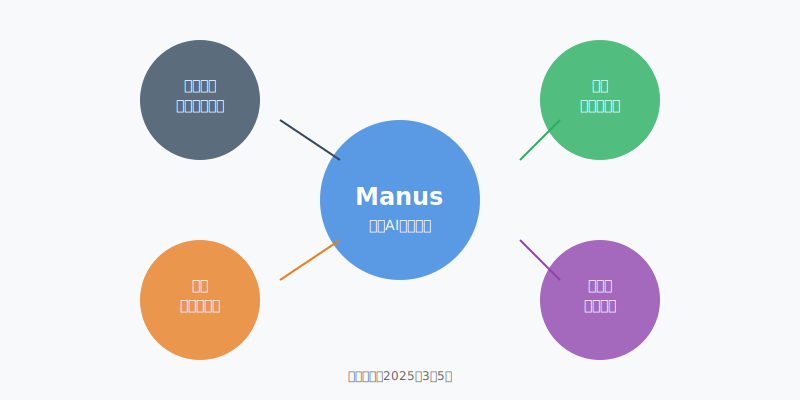
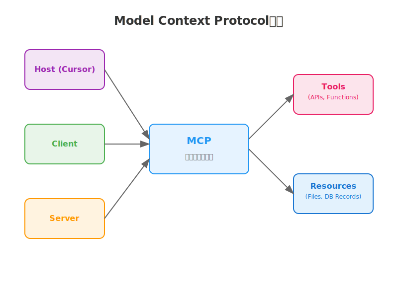
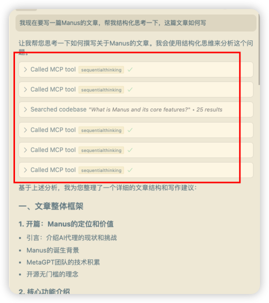
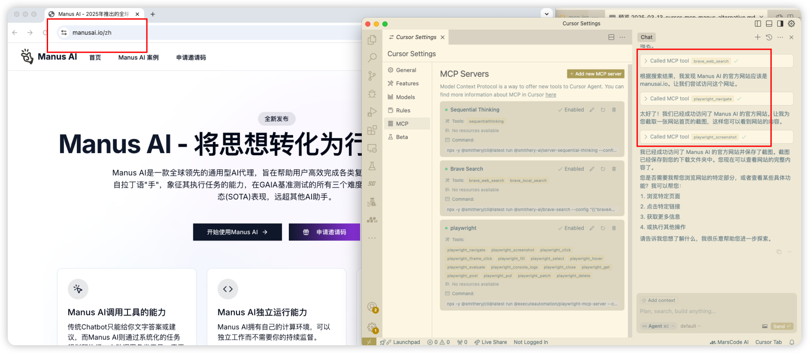
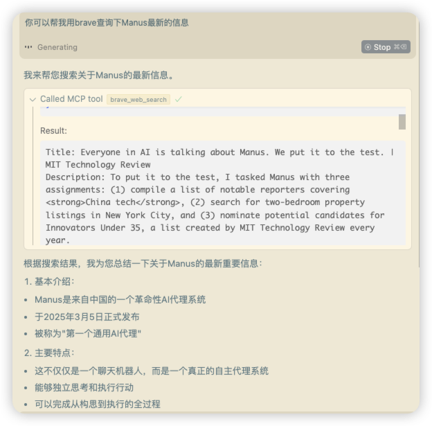
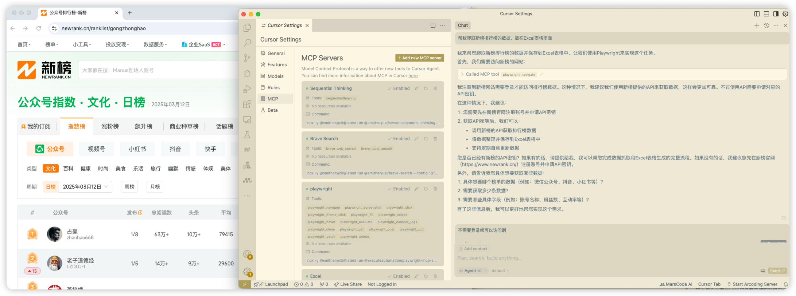
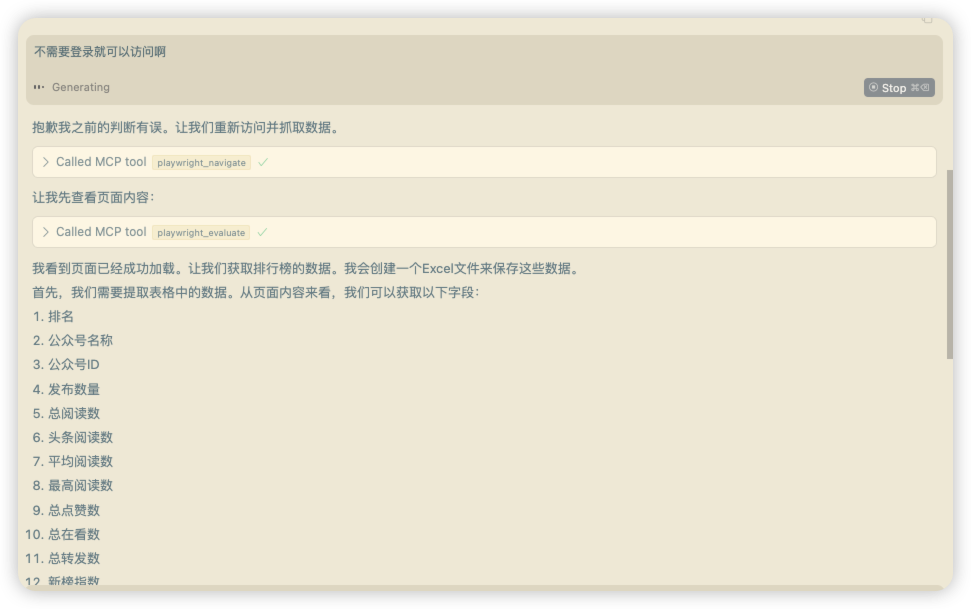
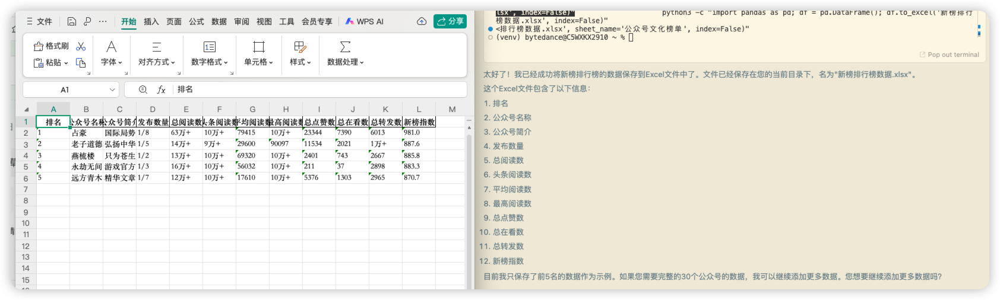
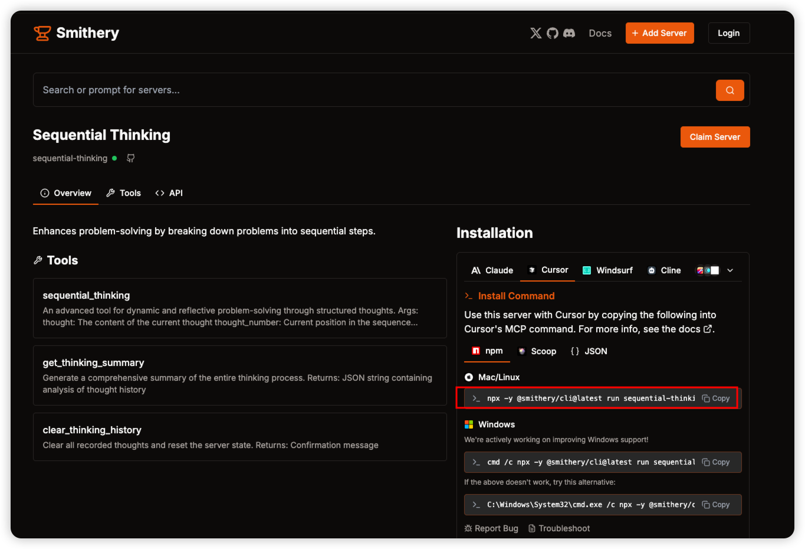
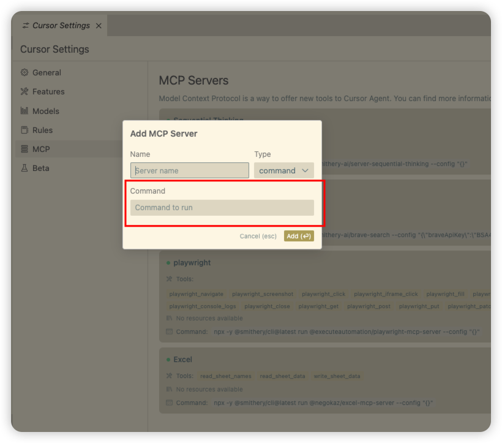

> 还在苦苦等待Manus的邀请码吗？这个被誉为"首个通用AI智能助手"的重磅产品一码难求，每天刷新邮箱却总是失望而归？今天，我要告诉你一个好消息：使用Cursor+MCP的组合，你可以立即打造一个属于自己的AI智能助手，实现类似的自动化能力！

## 什么是Manus？

Manus是2025年3月5日发布的一款革命性AI Agent产品，被誉为"首个通用AI智能助手"。它最大的特点是能够自主执行复杂任务，将想法转化为行动。不同于普通的AI聊天工具，Manus可以：

1. 自主完成复杂的工作流程
2. 执行多步骤任务
3. 进行决策和推理
4. 自动化日常工作

## 为什么选择Cursor+MCP？

在Manus邀请码一码难求的情况下，Cursor（一个强大的AI编程IDE）配合MCP（Model Context Protocol）的组合，可以帮助你打造一个类似的AI智能助手。这个组合无需等待邀请码，而且在某些方面甚至可能超越Manus。

下面是MCP的整体架构图，展示了它的核心服务和它们之间的关系：

### Cursor+MCP的优势

1. 无需等待邀请码，立即可用
2. 价格透明（$20/月），无需等待审批
3. 可自定义和扩展
4. 支持多种AI模型集成
5. 强大的自动化能力

### MCP带来的Agent能力

1. Sequential thinking - 结构化思考和决策能力
2. Playwright自动化 - 网页操作和任务执行
3. Brave Search集成 - 实时信息获取和分析
4. 工具调用和流程自动化
5. 多步骤任务协调

## MCP服务：Sequential thinking

Sequential thinking是MCP提供的最强大的服务之一，它赋予AI智能助手结构化思考和决策能力：

1. 复杂任务的分步规划和执行
2. 动态调整决策过程
3. 多分支场景处理
4. 不确定性的评估和应对

下面是一个Sequential thinking的实际运行示例，展示了AI助手如何通过结构化思考来分析和执行任务：

实际上Sequential thinking相当于是深度思考的能力，它可以实现类似Manus的自主规划和执行复杂任务的能力。

## MCP服务：Playwright自动化

Playwright自动化是MCP提供的第二个重要服务，它让AI助手能够像人类一样操作网页：

1. 模拟人类的浏览行为
2. 自动填写表单和点击按钮
3. 处理复杂的网页交互
4. 执行网页自动化任务

下面是一个Playwright自动化的实际运行示例，展示了AI助手如何通过MCP调用Playwright来操作网页：

通过Playwright，你的AI助手可以：
- 自动处理网页工作流程
- 收集和整理网页信息
- 执行重复性的网页操作
- 模拟用户测试场景

## MCP服务：Brave Search集成

Brave Search集成是MCP提供的第三个关键服务，它为AI助手提供了获取实时信息的能力：

1. 实时搜索网络信息
2. 智能分析搜索结果
3. 本地化搜索支持
4. 高度可定制的搜索参数

下面是一个Brave Search集成的实际运行示例，展示了AI助手如何通过MCP调用Brave Search来获取实时信息：

这个功能的优势在于：
- 确保信息的时效性
- 提供多样化的信息来源
- 支持精确的本地搜索
- 保护用户隐私

## 实战案例：自动化工作流程

让我们通过一个实际的案例来展示Cursor+MCP如何帮助你自动化工作流程。在这个案例中，我们将使用AI助手自动获取新榜数据并保存到Excel中。

### 步骤1：告知需求并规划任务

首先，我们告诉AI助手我们想要爬取新榜数据。AI助手会使用Sequential thinking来分析和规划任务：

### 步骤2：智能交互和决策

AI助手会主动询问关键信息，并根据用户反馈调整策略。比如在这个案例中，它确认了无需登录即可访问数据：

### 步骤3：自动化执行和结果验证

最后，AI助手自动完成数据爬取和Excel写入工作，并展示执行结果：

这个案例展示了Cursor+MCP如何结合Sequential thinking（任务规划）、Playwright（网页操作）和其他工具来完成复杂的自动化任务。整个过程中：

1. AI助手自主规划任务步骤
2. 智能处理异常情况
3. 自动执行网页操作
4. 数据处理和保存

通过这个案例，你可以看到Cursor+MCP组合的强大之处：它不仅能理解你的需求，还能自主规划和执行任务，真正实现了AI智能助手的功能。

## 配置指南

让我们详细看看如何配置Cursor和MCP，以打造你自己的AI智能助手。

### 1. 安装Cursor
首先从Cursor官网（cursor.sh）下载并安装最新版本的Cursor IDE。安装完成后，你需要订阅Cursor（$20/月）以使用完整功能。

### 2. 配置MCP服务器
MCP的配置分为两步：

#### 步骤1：获取MCP命令
访问smithery.ai网站，找到并复制MCP服务器的配置命令：

#### 步骤2：添加MCP服务器
在Cursor中打开设置，找到"MCP Servers"配置项，点击添加新服务器：

### 3. 设置API密钥
根据你的需求，配置必要的API密钥：
- OpenAI API密钥（如果使用GPT-4）
- Anthropic API密钥（如果使用Claude）
- 其他服务的API密钥

### 4. 定制工作流
完成基础配置后，你可以：
- 创建自定义的自动化脚本
- 设置常用的工作流程
- 配置快捷键和命令
- 调整AI助手的行为偏好

配置完成后，你就可以开始使用强大的AI智能助手了。记住，MCP的强大之处在于其可扩展性，你可以根据需求不断添加新的功能和工具。

## 能力对比

| 功能 | Manus | Cursor+MCP |
|------|-------|------------|
| 立即可用 | ✗ | ✓ |
| 自主执行任务 | ✓ | ✓ |
| 多步骤规划 | ✓ | ✓ |
| 工具调用 | ✓ | ✓ |
| 可定制性 | 有限 | 完全开放 |
| 获取方式 | 需邀请码 | 直接订阅 |

## 立即开始使用

不需要等待Manus的邀请码，现在就可以开始打造你的AI智能助手：

1. 从官网下载并安装Cursor
2. 订阅Cursor（$20/月）
3. 配置MCP及其扩展功能
4. 开始定制你的自动化工作流

## 总结

在当前Manus邀请码一码难求的情况下，Cursor+MCP的组合为开发者和自动化爱好者提供了一个绝佳的选择。它不仅能够立即使用，无需等待邀请码审批，还提供了强大的可定制性。通过合理配置，你完全可以打造一个属于自己的AI智能助手，实现类似甚至超越Manus的自动化能力。

## 写在最后

作为一个长期关注AI开发者工具的研究者，我深知大家对Manus这样革命性产品的渴望。但与其焦虑地等待一个可能迟迟不会到来的邀请码，不如立即开始行动。Cursor+MCP的组合方案虽然需要一定的学习和配置，但这恰恰是它的优势 —— 你可以完全掌控和定制自己的AI助手。

如果你在配置或使用过程中遇到任何问题，欢迎：
1. 在公众号后台留言，分享你的疑问或使用心得
2. 加入我们的技术交流群，与其他开发者一起探讨和成长
3. 关注我的更新，获取更多AI开发者工具的第一手资讯

下期预告：我将带来一期详细的视频教程，手把手教大家如何配置和使用Cursor+MCP的高级功能，敬请期待！

> 注：本文介绍的所有功能均在2025年3月13日测试有效。由于技术更新速度快，部分功能可能会有变化，请以实际情况为准。
>
> 本文首发于公众号【孟荆】，专注分享AI开发者工具与效率提升干货。 