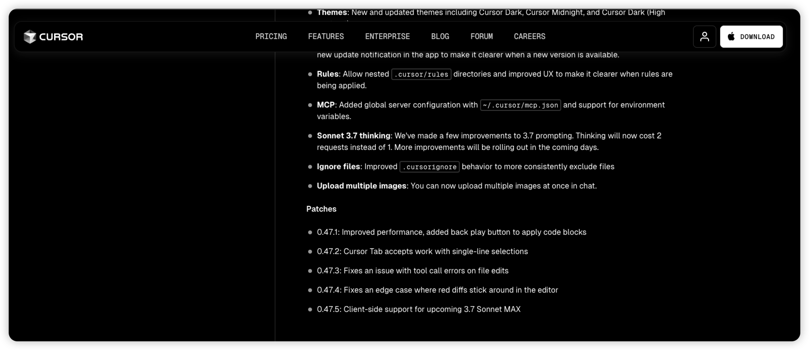

> 编者按：Cursor 最新版本（0.47.5）已经添加了对即将发布的 Claude 3.7 Sonnet MAX 的客户端支持。这一消息在开发者社区引发热议，特别是关于其定价策略和大上下文窗口的讨论。有开发者透露，该模型在测试阶段就展现出了强大的大上下文处理能力，这可能会给开发工作带来新的可能性。

### 一、大上下文处理能力

从开发者社区的讨论来看，Claude 3.7 Sonnet MAX 最受关注的特性是其大上下文窗口。有开发者提到，在测试阶段就发现其在处理大规模文本和代码时表现出色。这种能力可能会带来：

1. **更强的长文本理解**：
   - 处理更长的代码文件和文档
   - 保持更好的上下文连贯性
   - 提供更准确的长文本分析

2. **更全面的项目理解**：
   - 同时处理多个相关文件
   - 更好地把握项目整体结构
   - 提供更有针对性的建议

### 二、编程协作的新可能

从 Cursor 主动添加支持来看，Claude 3.7 Sonnet MAX 在编程领域可能会带来一些新的可能：

1. **代码处理能力**：
   - 更好地理解大型代码库
   - 处理更复杂的代码重构任务
   - 提供更连贯的代码生成

2. **开发工具集成**：
   - 与 Cursor 的深度整合
   - 更自然的编程协作体验
   - 更智能的代码补全和建议

### 三、实用场景展望

基于大上下文处理能力，我们可以期待以下应用场景：

1. **大型项目开发**：
   - 整体项目架构分析
   - 复杂代码库重构
   - 技术文档生成和维护

2. **知识密集型任务**：
   - 长文档分析和总结
   - 多文档对比和综合
   - 复杂问题的深入研究

### 四、开发者反馈

从社区讨论中，我们看到了不同的观点：

1. **积极期待**：
   - 开发者对大上下文窗口特性表示期待
   - 认为对复杂项目开发很有帮助
   - 期待更强的代码理解能力

2. **理性思考**：
   - 有开发者提醒需要注意模型在大上下文下的实际表现
   - 建议关注具体场景下的实用性
   - 期待看到更多实际使用案例

### 五、展望未来

虽然 Claude 3.7 Sonnet MAX 的具体细节还未公布，但从 Cursor 的提前支持和社区讨论来看，我们可以期待：

1. 更强大的代码理解能力
2. 更智能的项目协作体验
3. 更实用的大上下文应用场景
4. 更自然的开发工作流程

### 结语

Cursor 对 Claude 3.7 Sonnet MAX 的提前支持，反映了开发工具对大上下文 AI 助手的期待。虽然目前还无法得知其具体表现，但从社区讨论来看，这个新版本可能会为开发者带来更强大的 AI 协作体验。

让我们保持关注，看看这个即将发布的 AI 助手将如何助力我们的开发工作！ 