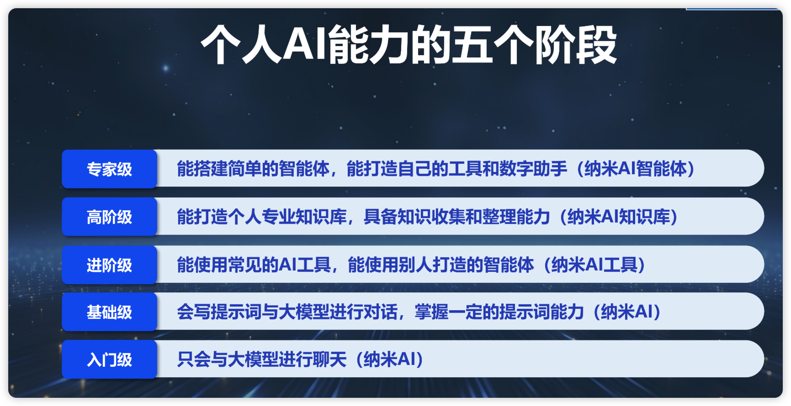
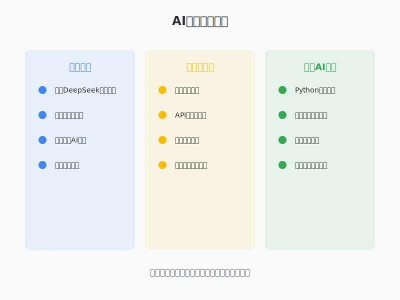
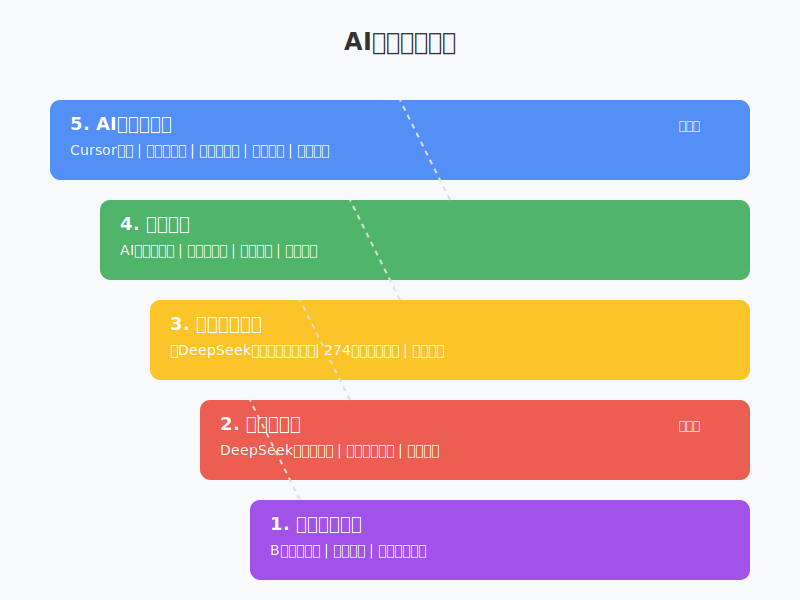

# 别焦虑！普通人的AI进阶指南：5个层次让你从入门到专家，人人都能学会

最近，我的新书《DeepSeek极简入门与应用》在市场上引起了不小的反响。每天都有很多AI初学者通过书籍找到我，问我同样的问题：究竟如何学习AI？怎么用AI赚钱？从这些问题中，我深深感受到了大家在AI时代的焦虑与困惑。

作为一个亲历AI发展的从业者，我深知这种焦虑。在这个AI快速发展的时代，很多人都面临着一个共同的困扰：要不要学习AI？从哪里开始学？需不需要深入理解底层原理？今天，就让我基于大家最关心的问题，结合我的实践经验，帮助你找到最适合自己的学习路径。

## 认清AI学习的五个层次

周鸿祎之前在清华的一次演讲中提到了个人AI能力的五个发展阶段，我觉得这个分类对于AI小白非常友好，可以帮助大家更好地规划自己的学习路径：

1. **入门级**：仅会与大模型聊天
   - 这是最基础的起点
   - 能够使用DeepSeek等AI工具进行简单对话
   - 适合所有想要了解AI的人

2. **基础级**：掌握提示词工程
   - 能够写出更好的提示词
   - 理解如何引导AI产出更优质的结果
   - 这是所有人都应该掌握的核心技能

3. **进阶级**：能使用AI工具
   - 熟练运用各类AI工具（生图、视频、编程等）
   - 能够将AI整合到日常工作流程中
   - 理解不同工具的特点和适用场景

4. **高阶级**：构建个人知识库
   - 能够建立自己的专业领域知识库
   - 具备知识收集和整理能力
   - 将AI与个人专业领域深度结合

5. **专家级**：能够构建简单的AI应用
   - 能够开发基础的AI应用
   - 理解API调用和简单的模型部署
   - 具备创造自己的AI工具的能力

## 如何选择适合自己的学习路径？

### 1. 明确你的目标

首先要问自己几个问题：
- 你是想提高工作效率？
- 还是想转行做AI开发？
- 或者只是想了解AI以免被时代淘汰？

不同的目标决定了不同的学习深度和路径。

### 2. 循序渐进的学习建议

根据不同人群的需求，我们可以规划出三条不同的学习路径：

#### 对于普通用户：
- 从使用DeepSeek等大模型开始
- 学习基础的提示词编写
- 尝试各种AI工具，提高工作效率
- 不需要过分关注底层原理

#### 对于技术从业者：
- 除了基础应用外，可以学习：
- API调用和集成
- 简单的模型部署
- 基础的机器学习概念

#### 对于想转行AI领域的人：
- 需要系统学习：
- Python编程基础
- 机器学习基础理论
- 深度学习框架
- 数学和统计学基础

## 关于"要不要学习底层原理"的回答

其实这个问题对于绝大多数人来说的答案都是否定的，除非你想做AI底层的研究和开发！

1. **如果你是普通用户**
   - 不需要深入底层原理
   - 把精力放在应用层面即可
   - 关注如何更好地使用AI工具

2. **如果你是开发者**
   - 需要了解基本原理
   - 但不必一开始就深入理论
   - 可以在实践中逐步深入学习

3. **如果你想成为AI专家**
   - 则必须系统学习底层原理
   - 需要扎实的数学和理论基础
   - 建议系统性地学习相关课程

## 实用的学习建议

作为一个AI从业者，我正在设计一套完整的学习体系，希望能帮助大家在AI时代找到适合自己的学习路径：

很多课程内容正在紧张筹备中，如果你也对AI学习感兴趣，欢迎关注我，我们一起在AI时代共同进步。在这个快速发展的领域，持续学习和实践是最重要的。

## 结语

面对AI时代，保持学习的热情很重要，需要找到适合自己的节奏和路径。不要被焦虑驱动，而是要理性地规划自己的学习之路。

每个人的起点和目标都不同，选择适合自己的路径才是最重要的。

最后，我想说的是，AI的发展确实很快，但这不应该成为我们的负担。

希望我们能够一起努力，把AI看作是一个助手和工具，帮助我们更好地完成工作，提高效率。

只要我们保持学习的心态，就一定能在这个AI时代找到自己的位置！ 