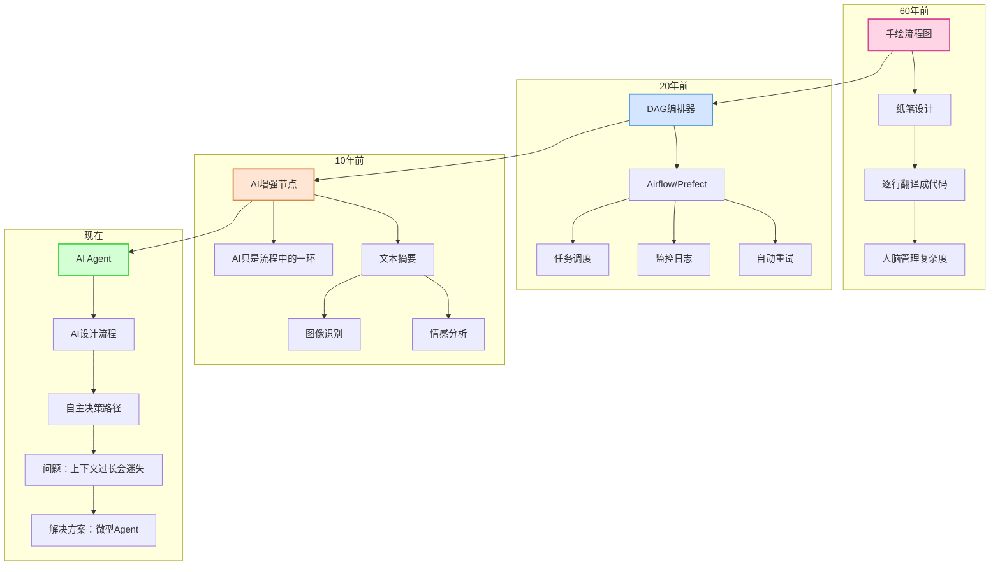

# AI Agent凭什么火？看懂60年软件演进史，你就明白了

图片

前几天，一位做了20年开发的朋友跟我说：

"现在的AI Agent让我想起当年第一次用Spring框架的感觉——既兴奋又迷茫。"

我深有同感。

每一次技术范式的转变，都会让我们重新审视"什么是软件"这个根本问题。

最近在研究12-Factor Agent框架时，看到了一篇特别有意思的软件简史。

作者用一个简单却深刻的视角，带我们回顾了软件开发60年的演进之路。

看完之后，我突然明白了一件事：

**原来我们写了60年代码，本质上都在做同一件事——画流程图。**

只不过，画图的方式越来越高级罢了。

让我们先看看这60年的演进全貌：



图片

## 60年前：一切都是流程图

还记得大学时代学C语言，老师总是让我们先画流程图吗？

那时候觉得很烦，现在想想，老师真是用心良苦。

因为**软件的本质，就是一个有向图（DAG）**。

```
开始 → 输入数据 → 处理 → 判断 → 输出结果 → 结束
```

60年前的程序员，真的是在纸上画流程图，然后一步步翻译成代码。

每个判断分支、每个循环结构，都要仔细设计。

就像搭积木，一块一块地拼接。

问题是，积木越来越多，图越来越复杂，人脑已经hold不住了。

图片

## 20年前：让机器帮我们管理流程

2000年前后，出现了一批DAG编排工具：

- Airflow（空气流，名字就很形象）
- Prefect（完美编排）
- Dagster（DAG大师）

这些工具的核心思想很简单：

既然软件是流程图，那就让专门的工具来管理这些流程。

```python
# 以前我们这样写
def process_data():
    data = fetch_data()
    cleaned = clean_data(data)
    result = analyze(cleaned)
    save_result(result)

# 现在可以这样
@task
def fetch_data():
    pass

@task
def clean_data(data):
    pass

@flow
def data_pipeline():
    data = fetch_data()
    cleaned = clean_data(data)
    # 自动处理重试、监控、日志...
```

**这就像从手工作坊升级到了流水线工厂。**

每个步骤都清晰可见，出错了能自动重试，还能监控每个环节的状态。

程序员终于可以专注于业务逻辑，而不是纠结于异常处理和任务调度。

图片

## 10年前：AI开始帮我们处理部分节点

当机器学习模型变得实用后，我们开始在流程图中加入AI组件：

- "用AI总结这一列的文本"
- "用情感分析判断客户反馈"
- "用图像识别检测产品缺陷"

但本质上，**AI只是流程图中的一个节点**。

整体架构还是确定性的，只是某些步骤变聪明了。

就像工厂流水线上，某些工位换成了机器人，但流水线本身没变。

图片

## 现在：AI说"让我来画流程图"

这就是AI Agent带来的真正革命。

传统方式：
```
程序员：我要设计10个步骤，处理5种异常情况
AI：我是第3步的执行者
```

Agent方式：
```
程序员：这是目标，这是可用的工具
AI：我来决定用哪些工具，按什么顺序
```

**从"AI执行流程"到"AI设计流程"，这是质的飞跃。**

就像从"司机开车"进化到"自动驾驶"。

你只需要告诉它目的地，路线规划交给AI。

图片

## 理想很丰满，现实很骨感

但是，就像自动驾驶在复杂路况下会迷路一样，AI Agent也有个致命问题：

**上下文太长时，它会迷失方向。**

我曾经让一个Agent帮我重构代码，前10轮对话还好，到了第20轮，它开始：

- 重复之前试过的方案
- 忘记最初的目标
- 在错误的路上越走越远

这就像一个人在迷宫里转圈，走得越久越迷糊。

即使GPT-4支持128k token的上下文，但经验告诉我们：

> **短小精悍的提示词和上下文，永远比长篇大论效果更好。**

图片

## 实践中的解决方案：微型Agent

既然让AI管理整个流程容易失控，那就让它管理局部流程。

这就是"微型Agent"的思路：

```
确定性流程
    ↓
  步骤1（普通代码）
    ↓
  步骤2（微型Agent：处理3-5个相关任务）
    ↓
  步骤3（普通代码）
```

举个真实的例子——部署机器人：

1. **人类**：合并代码到主分支
2. **确定性代码**：部署到测试环境
3. **确定性代码**：运行自动化测试
4. **微型Agent**：负责生产部署的人机交互
   - Agent：准备部署前端
   - 人类：先部署后端吧
   - Agent：好的，先部署后端
   - 人类：批准
   - Agent：后端部署完成，现在部署前端
5. **确定性代码**：运行生产环境测试

这个Agent只负责一件事：**理解人类的部署意图并执行**。

任务明确，上下文可控，不会迷失。

图片

## Agent的本质：四个核心组件

剥开所有花哨的外衣，一个Agent其实就是：

1. **Prompt（提示词）**：告诉AI可以做什么
2. **Switch语句**：根据AI的决策执行相应动作
3. **上下文累积**：记录已经发生的事
4. **For循环**：重复直到任务完成

```python
context = [初始任务]
while True:
    # AI决策下一步
    next_action = ai.decide(context)

    # 执行动作
    if next_action == "完成":
        break
    result = execute(next_action)

    # 累积上下文
    context.append(result)
```

就这么简单。

但简单的东西，往往最有力量。

图片

## 从12-Factor App到12-Factor Agent

说到这里，不得不提到另一个有趣的演进。

还记得2011年Heroku提出的12-Factor App吗？

那是云原生应用的黄金法则：

- 一份代码，多处部署
- 显式声明依赖关系
- 在环境中存储配置
- 把后端服务当作附加资源
- ...

**12年后的今天，我们迎来了12-Factor Agent。**

从App到Agent，不仅仅是名字的改变，更是思维模式的转变：

| 12-Factor App | 12-Factor Agent |
|--------------|----------------|
| 无状态进程 | 有记忆的智能体 |
| 配置与代码分离 | 提示词与逻辑分离 |
| 日志作为事件流 | 对话作为决策流 |
| 管理进程 | 管理上下文 |

这种演进告诉我们：

**软件正在从"被动执行"走向"主动思考"。**

图片

## 写在最后：我们还在画流程图

回顾软件开发60年的历史，我们一直在做三件事：

1. **画流程图**（设计逻辑）
2. **优化画图方式**（提高效率）
3. **让图自己画自己**（智能化）

从手绘流程图，到DAG编排器，再到AI Agent。

工具在变，思维方式在变，但本质没变。

不同的是，现在我们有了一个会思考的画图助手。

它可能还不够完美，偶尔会迷路，但潜力无限。

正如那位朋友说的：

"每一次范式转变，都让我们重新认识软件开发。AI Agent可能不是终点，但一定是一个重要的里程碑。"

你觉得呢？

在你的开发经历中，有没有类似的"范式转变"时刻？

欢迎在评论区分享你的故事。

---

作者 | 梦见，一个相信技术改变世界的程序员
主播 | 夏萌，用声音记录技术的温度
图片 | 视觉中国，网络（如有侵权请联系删除）

▼点击下方卡片 发现更多技术故事
图片
