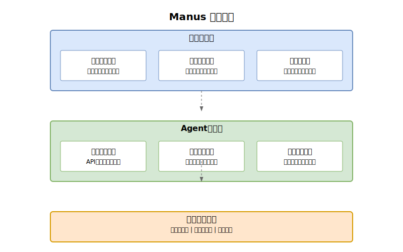

## 引言

在AI领域，一个来自中国的创新正在引发全球瞩目。Monica推出的通用AI agent——Manus，凭借其独特的技术架构和卓越的任务处理能力，不仅在国内引发热议，更获得了国际AI社区的广泛关注。在过去的一周里，从Hugging Face到Twitter的科技领袖们纷纷对这一突破性成果发表评论，将其视为AI Agent发展史上的重要里程碑。

在当前AI快速发展的背景下，各大科技公司都在积极布局AI Agent领域。然而，大多数AI助手仍然存在知识运用与实际执行之间的鸿沟。Manus的出现，不仅展示了一种全新的技术路径，更预示着AI Agent发展范式的重要转变。本文将深入分析Manus的技术创新、国际影响，以及它为AI Agent发展带来的新思考。

## Manus的技术创新

### 1. 跨领域任务处理能力

Manus最显著的技术突破在于其强大的跨领域任务处理能力。不同于传统AI助手仅能在特定领域提供建议，Manus能够：

- **智能任务分解**：将复杂的跨领域任务自动分解为可执行的子任务序列
- **上下文理解**：在任务执行过程中保持对全局目标的理解，确保子任务的连贯性
- **知识迁移**：灵活运用不同领域的知识，实现创新性的问题解决

例如，当用户要求完成一个涉及编程、设计和数据分析的项目时，Manus能够自主规划任务流程，并在执行过程中动态调整策略。

### 2. "知行合一"的突破

Manus最具革命性的创新在于实现了AI系统的"知行合一"，这体现在一个完整的闭环过程中：

1. **需求理解**
   - 深度语义分析，准确理解用户意图
   - 提取关键目标和约束条件
   - 建立清晰的任务认知模型

2. **方案规划**
   - 基于已有知识制定执行方案
   - 将复杂任务分解为可执行步骤
   - 预估可能的风险和替代方案

3. **实际执行**
   - 自动生成代码或执行指令
   - 实时监控执行过程
   - 处理异常和意外情况

4. **反馈优化**
   - 收集执行结果和用户反馈
   - 持续改进执行策略
   - 更新知识库和经验模型

例如，在开发任务中，Manus不仅能理解用户的需求（知），还能直接生成符合要求的代码（行），并根据运行结果和反馈不断优化。这种闭环的"知行合一"机制使Manus能够：

- 从失败中学习，持续改进执行策略
- 积累实践经验，提高解决方案的质量
- 适应不同场景，灵活调整执行方式

### 3. 核心技术架构

Manus的技术架构采用分层设计，重点突出应用层的Agent能力：

1. **应用层能力**
   - **任务规划引擎**：智能分解复杂任务，制定最优执行路径
   - **上下文管理器**：维护长期会话状态，确保目标连贯性
   - **执行优化器**：根据反馈动态调整策略，提升执行效果

2. **Agent能力层**
   - **工具调用系统**：灵活调用各类API和工具，扩展执行能力
   - **知识检索系统**：实时获取和验证信息，确保决策准确性
   - **执行反馈系统**：分析执行结果，积累优化经验

3. **基础模型能力**
   - 基于大语言模型的自然语言理解与生成
   - 多模态信息处理能力
   - 知识图谱支持的推理能力

这种架构设计使Manus能够：
- 有效处理复杂的多步骤任务
- 保持长期对话的连贯性和目标导向
- 通过实践不断积累和优化执行经验
- 灵活扩展新的工具和能力

## 全球影响与中国AI创新机遇

### 1. 国际瞩目的技术突破

- **主流评测反响**
  - MIT Technology Review评价其为"高度智能和高效的实习生"，每任务2美元的高性价比引发关注
  - The Register验证其50窗口并行数据分析能力，展现卓越的多任务处理效率
  - 一周内吸引18.6万+Discord用户，开创中国AI出海新模式

- **技术创新亮点**
  - 多模型协同：整合Claude 3.5 Sonnet和定制版Qwen，实现真正的通用AI架构
  - 透明化工作流：创新性"Manus's Computer"窗口设计，提供实时观察和干预能力
  - 自主导航能力：相比ChatGPT DeepResearch展现更强的任务分解和执行效率

### 2. 发展挑战与突破路径

- **技术挑战与应对**
  - 基础设施：通过自主创新解决高负载稳定性问题
  - 场景适配：深化产学研合作，优化特定领域表现
  - 生态建设：构建开放协作平台，推动跨领域创新

- **中国独特优势**
  - 市场规模：庞大用户基础提供丰富的应用场景和反馈
  - 技术积累：AI框架持续优化，算法体系不断完善
  - 创新环境：充足人才储备+政策支持形成良性发展循环

### 3. 开源社区的积极响应与争议

- **快速复刻与质疑声**
  - MetaGPT团队仅用3小时开发出OpenManus开源版本，获得16K+星标
  - 多个开源实现相继涌现，如henryalps/OpenManus等
  - 开源版本移除邀请码限制，但引发性能争议
  
- **能力差距与局限性**
  - GAIA基准测试显示明显差距：
    - 一级任务：Manus (86.5%) vs OpenManus (65.3%)
    - 二级任务：Manus (70.1%) vs OpenManus (48.7%)
    - 三级任务：Manus (57.7%) vs OpenManus (31.2%)
  - 复杂场景处理能力不足：
    - 跨领域任务协同效果欠佳
    - 上下文长度限制导致大型项目中断
    - 缺乏商业版本的深度优化与调优
  
- **社区分歧**
  - 支持者认为开源降低准入门槛，促进技术民主化
  - 质疑者指出"3小时复刻"更像是营销噱头
  - Monica团队回应："欢迎创新，但不应以牺牲性能为代价"
  
- **发展前景**
  - 活跃的开发者社区持续优化核心功能
  - 通过引入强化学习等技术缩小差距
  - 商业版本与开源方案或将长期并存，服务不同用户群体

### 4. 引领全球AI发展新范式

- **技术路线创新**
  - 从单一模型到多模型协同系统
  - 从封闭执行到透明可控流程
  - 从专项能力到通用智能平台

- **商业化路径突破**
  - 个人助理→企业解决方案→行业标准服务的渐进式发展
  - 能力模块订阅+定制开发的双轨并行
  - 产业链协同创新，打造完整生态体系

这些创新不仅展示了中国AI技术的实力，更为全球AI Agent的发展提供了新思路。Manus的成功表明，中国企业正在从技术追随者转变为创新引领者。随着技术的不断成熟和产业生态的持续优化，中国AI将在更广泛的领域发挥重要作用，为全球人工智能发展贡献更多中国智慧。

## 结语

Manus的横空出世，不仅展示了中国AI技术的创新能力，更为全球AI Agent的发展提供了全新思路。它的成功证明，在AI这个快速发展的领域，创新不分国界，突破可以来自任何地方。中国企业通过持续的技术积累和创新实践，正在重塑全球AI发展的格局。

展望未来，AI Agent领域的竞争将更加激烈，但也带来了更多的合作机会。中国企业需要继续保持创新的勇气和开放的心态，在技术创新的道路上不断前进。我们有理由相信，随着像Manus这样的创新不断涌现，中国在全球AI发展中的影响力将进一步提升，为人工智能的未来发展贡献更多中国智慧。

---

> 关于作者：
> 
> 专注于AI技术发展与创新研究，持续关注全球AI领域的最新动态。欢迎关注我的微信公众号，获取更多AI领域的深度分析。 