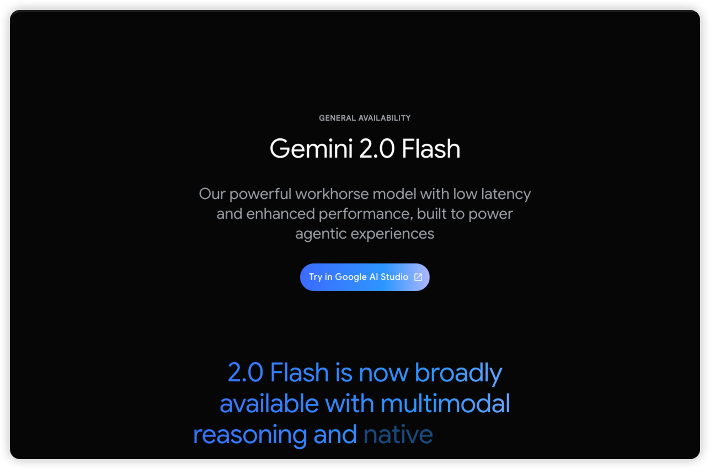
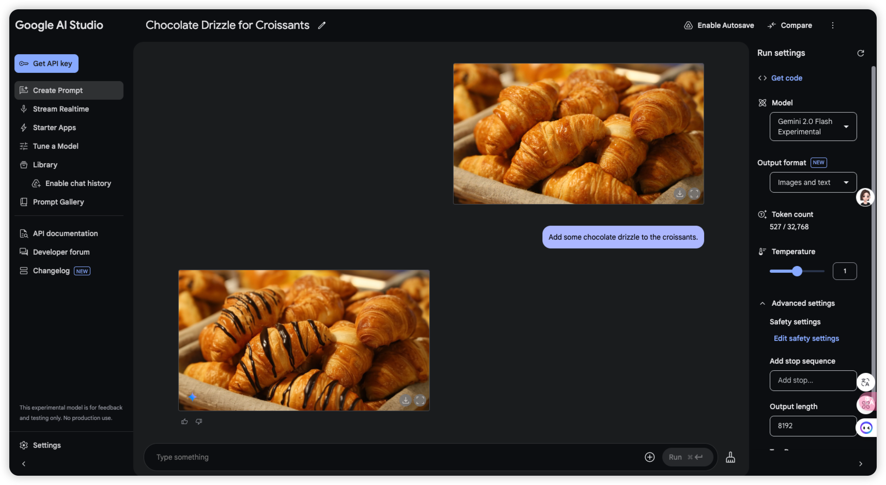
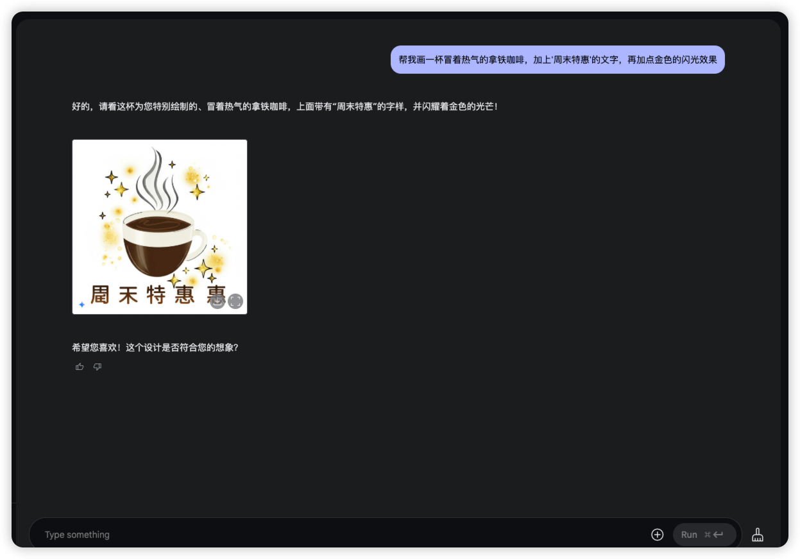
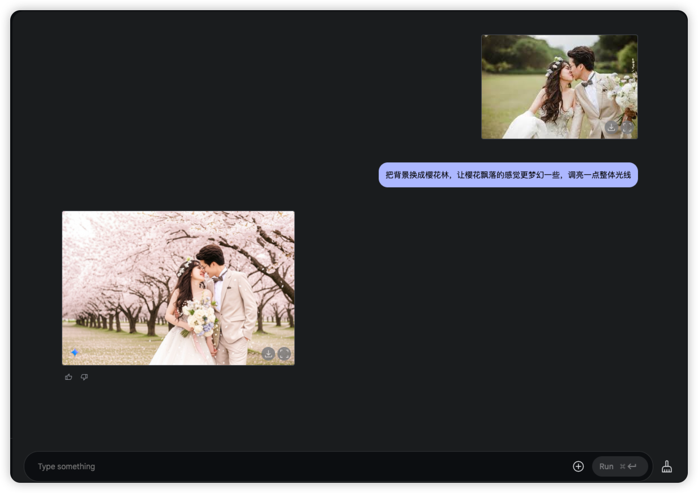
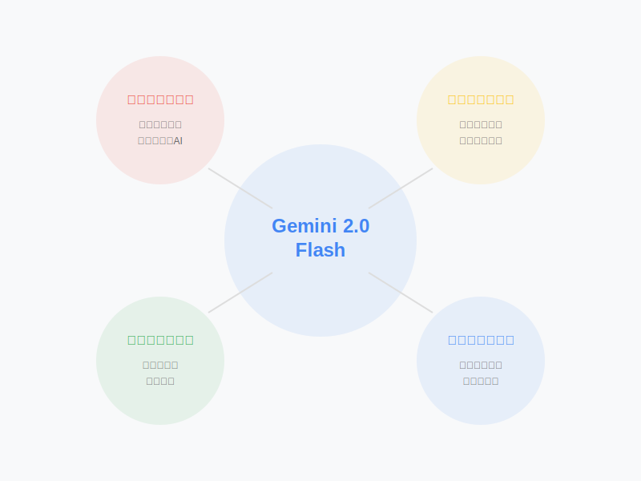
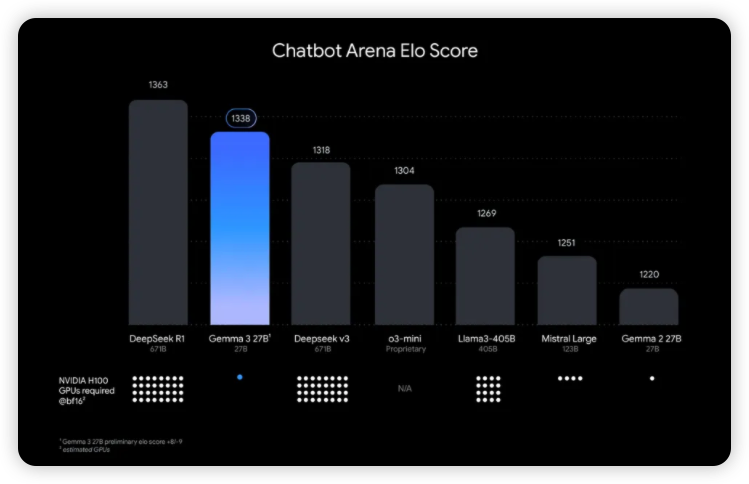

# 重磅:一句话就能P图!Google新AI让你告别PS,还开源了一个比GPT-4便宜10倍的超强模型

> "给这张照片加上巧克力酱" - 一秒完成
> "把背景换成巴黎铁塔" - 瞬间搞定
> "帮我画一个可爱的卡通头像" - 马上就好

这不是科幻电影里的场景,而是Google最新发布的Gemini 2.0 Flash带来的革命性突破。更令人兴奋的是,Google还同步开源了一个能与GPT-4掰手腕,却只需十分之一成本的超强模型Gemma 3!

## 告别PS时代:用对话改变图片

还在为PS太难而发愁?还在为找图片素材烦恼?现在,你只需要和AI对话,就能完成各种高级图片创作和编辑:

### 案例1:一分钟出图文推广

小王是一家咖啡店的运营,以前做一张朋友圈图片要折腾半天。现在他只需要:
1. "帮我画一杯冒着热气的拿铁咖啡"
2. "加上'周末特惠'的文字"
3. "再加点金色的闪光效果"
搞定! 看上去还不错，就是对中文字体支持不太友好。

### 真实案例2:智能图片编辑

小美在准备婚纱照,发现有张照片背景不够理想:
1. "把背景换成樱花林"
2. "让樱花飘落的感觉更梦幻一些"
3. "调亮一点整体光线"
完美!比修图师傅改得还要快还要好。

### 为什么Gemini 2.0 Flash如此强大?

1) **原生多模态理解**
- 首个在模型内直接支持图像生成的AI
- 比其他AI快2-3倍
- 理解更准确,生成更自然

2) **超强的上下文理解**
- 记住你之前的所有修改要求
- 保持画面风格一致性
- 理解专业领域知识

3) **革命性的编辑体验**
- 像跟人聊天一样改图
- 所见即所得,实时预览
- 支持无限次修改

4) **突破性的文字处理**
- 完美解决文字变形问题
- 支持40+种语言完美排版
- 特别优化中文显示效果

## 更劲爆的是：Gemma 3来了！

> 图中展示了各大模型在Chatbot Arena的Elo评分，分数越高代表用户体验越好。Gemma 3 27B以1336分的成绩仅次于DeepSeek R1（1363分），但硬件需求却只有后者的1/32！底部的白点表示运行所需的NVIDIA H100 GPU数量。

如果说Gemini 2.0 Flash是Photoshop终结者，那么全新发布的Gemma 3就是一个革命性的开源模型。它不仅能在单个GPU上运行，还带来了一系列突破性的能力：

### 核心突破：
- **超强性能**：在LMArena排行榜上击败了Llama3-405B、DeepSeek-V3等大模型
- **硬件友好**：仅需一张GPU/TPU就能运行，是同等性能中最节省资源的模型
- **多语言支持**：原生支持35种语言，预训练支持超过140种语言
- **超长上下文**：128K tokens的上下文窗口，可以处理更长的内容
- **多模态能力**：支持分析图像、文本和短视频，开启更多可能性

### 四种规格任你选：
- 1B：适合移动设备
- 4B：入门级GPU就能跑
- 12B：中等配置首选
- 27B：企业级应用最佳选择

## 马上行动起来!

1. **立即尝鲜Gemini 2.0 Flash**
- 访问 Google AI Studio
- 免费获取API密钥
- 开始你的AI创作之旅

2. **免费使用Gemma 3**
- 从Hugging Face下载模型
- 一键在本地部署
- 打造专属AI助手

想第一时间了解更多AI技术资讯,欢迎关注我们的公众号。我们将持续为您带来:
- 最新AI技术解读
- 实用开发教程
- AI实践经验
- 行业深度分析

---
关注"孟健的AI编程认知",开启你的AI新生活!

