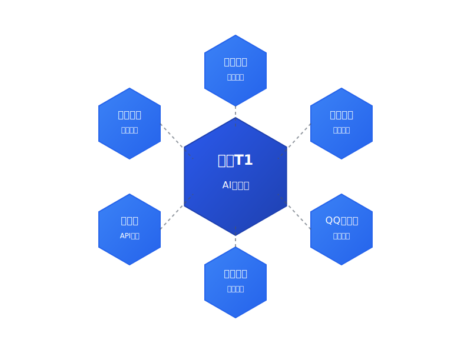
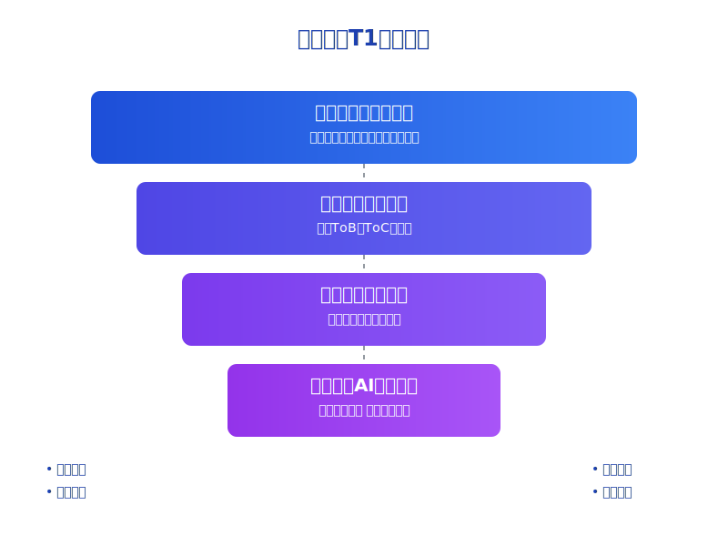

# 重磅！腾讯混元T1发布：不仅吊打DeepSeek，还要做最懂中国人的AI！

> 震撼！3月21日深夜，腾讯突然官宣自研深度思考模型混元T1！这个重磅发布让国内AI圈沸腾了！为什么说这是一个划时代的产品？且看这些惊人的数据！

## 一、实力对标GPT-4.5，多项指标让国际巨头"汗颜"

不得不说，这次腾讯是真的动真格的！从公开测试数据来看，混元T1简直就是一匹"黑马"，多项指标直接碾压同行：

- 🏆 **知识理解能力**：MMLU PRO测试斩获87.2分！不仅超越DeepSeek R1的84.0分，更是直逼GPT-4.5！
- 🎯 **数学推理能力**：MATH-500测试中惊艳得分96.2分，与DeepSeek R1的97.3分旗鼓相当！
- 🌟 **中文理解能力**：CEval和CMMLU双双突破90分大关！这次，终于有了真正懂中国人的AI！
- ⚡ **逻辑推理能力**：DROP F1考试93.1分，Zebra Logic得分79.6分，展现出超强算力！

## 二、惊艳！全新架构让速度提升3倍，价格却只要竞品1/4！

最让人震惊的是，混元T1首创性地将Hybrid-Mamba-Transformer架构应用于超大规模模型，这一突破简直是降维打击：

1. 🚀 **极速响应，快得让你窒息**
   - 首字秒出，生成速度飙升至60-80 tokens/s
   - 完全碾压DeepSeek R1（仅20 tokens/s）
   - 用过的都说快！体验秒杀同类产品！

2. 📚 **超长文本处理，轻松搞定万字文档**
   - 2万字文档？一键搞定！
   - 独创阶梯式扩展，告别"丢三落四"
   - 合同、论文分析？交给混元就对了！

3. 💰 **价格优势，这才是真正的"平民化"AI**
   - 输入只要1元/百万tokens
   - 输出仅需4元/百万tokens
   - 惊喜不？这还不是促销价！

## 三、全面开花！腾讯系产品已经全部接入

重磅消息！混元T1已经全面进驻腾讯全家桶：

- 💎 腾讯元宝：24小时随时对话，知识问答不再发愁
- 📚 微信读书：智能推荐，让阅读更有趣
- 🌐 QQ浏览器：搜索总结一步到位，效率提升不止一点点
- 📝 腾讯文档：创作助手在手，写作难题都不愁

更让人兴奋的是，腾讯云已经开放API接口，企业用户可以立即接入使用！

## 四、技术解密：为什么说混元T1是一个划时代产品？

1. 🔥 **颠覆性架构创新**
   - 首创Hybrid-Mamba-Transformer融合架构
   - Mamba超强序列处理+Transformer推理能力
   - 这次，腾讯是动了真格的！

2. 🎯 **专项能力突破**
   - 重点强化数理逻辑训练
   - 课程难度层层递进
   - 思维链推理能力大幅提升

3. 🤝 **最懂中国人的AI**
   - Self-Rewarding机制确保高质量输出
   - 统一奖励系统让响应更精准
   - 指令理解能力突飞猛进

## 五、重塑行业格局！国产AI的春天真的来了！

这次混元T1的发布，不仅是一次产品升级，更是腾讯在AI领域的战略升维：

1. 🏆 **全面领先的技术布局**
   - 从基础模型到应用层的完整技术栈
   - 首创Hybrid-Mamba架构破局性能瓶颈
   - 开源战略助力产业生态发展
   
2. 🌐 **产业数智化的新引擎**
   - 全面赋能腾讯产品矩阵
   - 打通ToB和ToC双赛道
   - 构建"云智一体"新格局

3. 🚀 **开放共赢的生态战略**
   - 持续开源核心技术能力
   - 降低AI应用门槛
   - 携手伙伴共建产业新生态

4. 🎯 **中国特色的AI发展之路**
   - 深耕中文语言理解
   - 本土场景深度适配
   - 引领AI技术"中国方案"

在这个AI技术爆发的关键节点，混元T1的发布意义深远。它不仅展现了中国科技企业在AI领域的创新实力，更开创了一条具有中国特色的AI发展道路。通过技术创新、成本优化和生态共建，腾讯正在用实际行动推动AI技术的普惠化和民主化，让更多企业和个人能够真正享受到AI带来的红利。

这不仅是一场技术革新，更是产业变革的新起点。随着混元T1的发布，我们看到的不只是一个优秀的AI产品，更是中国科技力量在全球AI竞争中的一次重要突破。这预示着，属于中国的AI时代，正在加速到来！

## 重磅预测：这可能是2025年最重要的AI产品发布！

腾讯混元T1的横空出世，不仅展示了中国科技企业的实力，更预示着我们离真正的AI时代又近了一步。它的每一项突破，都将推动整个行业向前发展。这不仅是一场技术革新，更是AI民主化的里程碑！

想第一时间了解更多AI技术突破和实战经验？

👉 点击关注「孟健AI编程」，和我一起见证AI技术的每一次突破！

#AI技术 #腾讯混元 #AI模型 #技术创新 #ChatGPT 